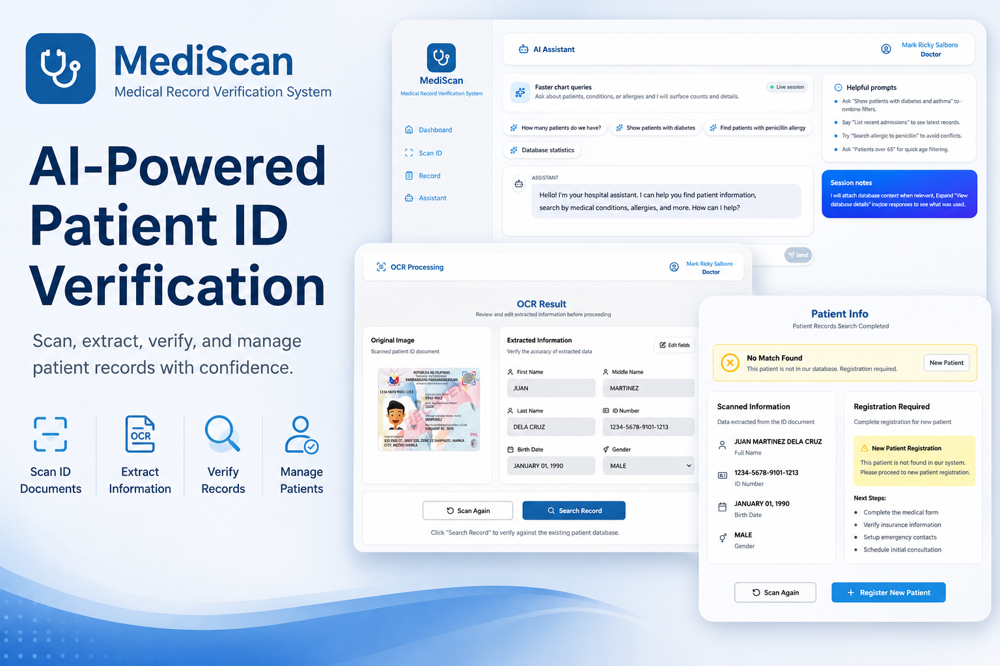

# MediScan

## Overview
MediScan is a Medical Record Verification System powered by LLM and CNN technologies that verifies patient records using ID-based authentication. The system checks whether a patient already has an existing medical record and allows healthcare staff to create new records for new patients. It integrates AI technologies for intelligent document verification, OCR-based text extraction, secure data processing, and medical record management.

## Features
- ID-based patient verification
- Medical record checking and validation
- New patient record creation
- OCR-powered text extraction using EasyOCR
- AI-powered chatbot integration using Ollama
- Secure medical record management
- Full-stack web application architecture

## Tech Stack

### Frontend
- React
- TypeScript

### Backend
- Express.js
- Flask

### AI / Machine Learning
- Python
- EasyOCR
- Ollama (Chatbot Integration)
- CNN (Convolutional Neural Network)

### Database
- MongoDB