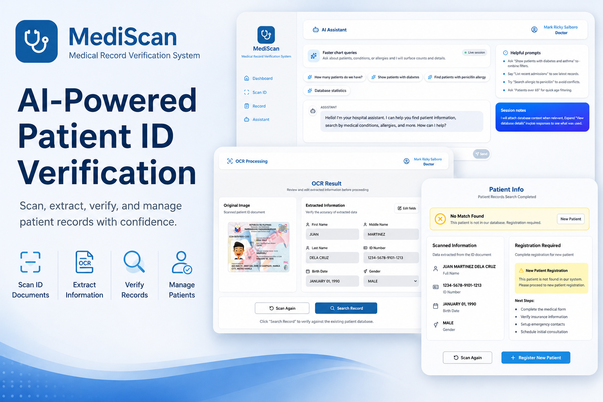

# MediScan



## Overview
MediScan is a Medical Record Verification System powered by LLM and CNN technologies that verifies patient records using ID-based authentication. The system checks whether a patient already has an existing medical record and allows healthcare staff to create new records for new patients. It integrates AI technologies for intelligent document verification, OCR-based text extraction, secure data processing, and medical record management.

## Features
- ID-based patient verification
- Medical record checking and validation
- New patient record creation
- OCR-powered text extraction using EasyOCR
- AI-powered chatbot integration using Ollama
- Secure medical record management
- Full-stack web application architecture

## Tech Stack

### Frontend
- React
- TypeScript

### Backend
- Express.js
- Flask

### AI / Machine Learning
- Python
- EasyOCR
- Ollama (Chatbot Integration)
- CNN (Convolutional Neural Network)

### Database
- MongoDB

## Running the Services

Install the prerequisites before starting the services:

- Node.js and npm
- Python 3
- MongoDB running locally on `127.0.0.1:27017`

Run each service in its own terminal from the repository root.

### AI Classifier

The AI classifier runs on `http://localhost:5000` and uses the model weights stored in `Ai/cnn_model_mediscan`.

```powershell
cd Ai/cnn_model_mediscan
python -m venv .venv
.\.venv\Scripts\Activate.ps1
python -m pip install -r requirements.txt
python app.py
```

Verify that it is running by opening `http://localhost:5000`.

### API

The Express API runs on `http://localhost:3001` and connects to the local MongoDB database `hospital_data`.

```powershell
cd Api/mediscan_crud
npm install
node src/app.js
```

Verify that it is running by opening `http://localhost:3001`.

### ID Extractor

The ID extractor runs on `http://localhost:5001` and loads EasyOCR when the first extraction request is made.

```powershell
cd Id_Extractor/id_information_extractor
python -m venv .venv
.\.venv\Scripts\Activate.ps1
python -m pip install -r requirements.txt
python app.py
```

Verify that it is running by opening `http://localhost:5001`.

### Frontend

After the AI classifier, API, and ID extractor are running, start the React frontend in another terminal:

```powershell
npm install
npm run dev
```